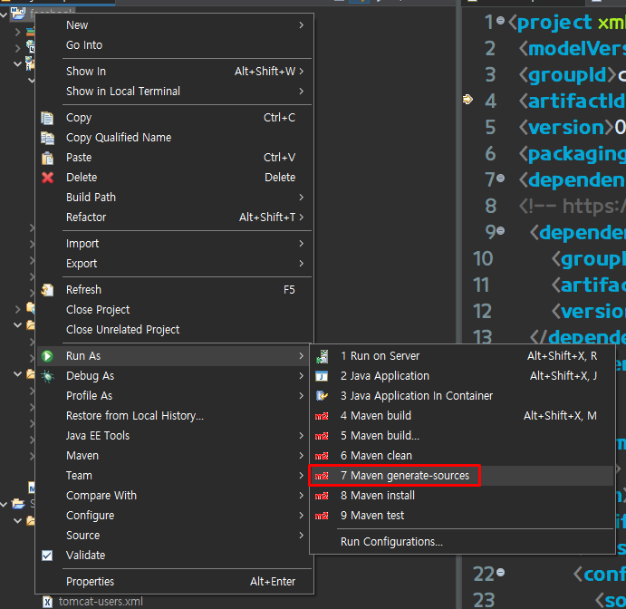
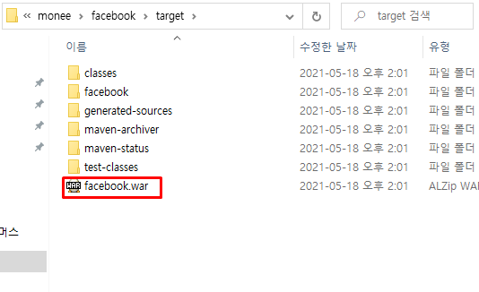
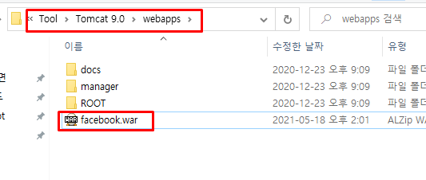
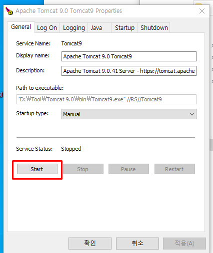
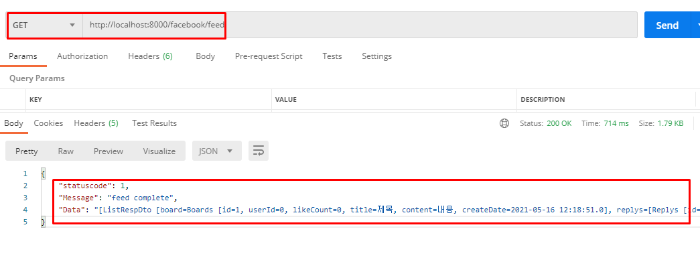
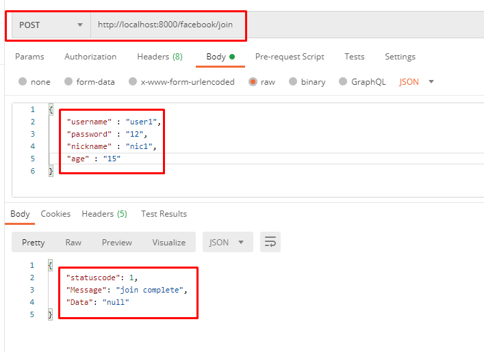
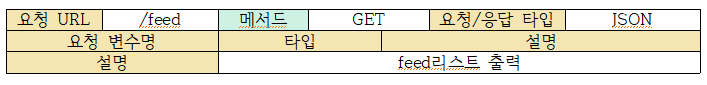
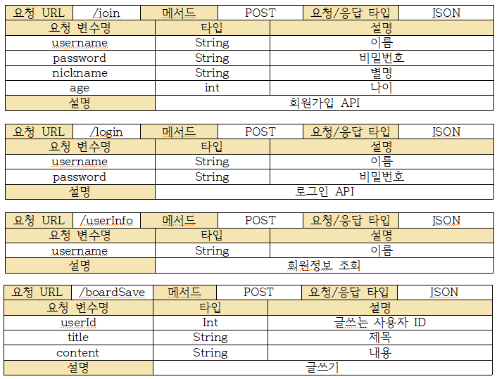
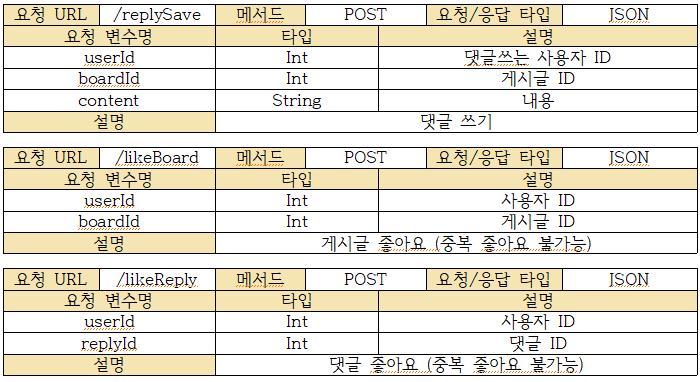

# Facebook api 구현


안녕하세요. 
진경빈입니다.  


# 목차
- 개발 환경
- 문제해결 전략
- 프로젝트 빌드
- 실행 방법
- 기능
- API
- DB

# 개발 환경
- 개발언어 : JAVA Maven 4.0
- IDE : STS
- DB : Mysql 8.0
- WAS : tomcat 9.0.41
  
# 문제해결 전략
이번 사전과제를 maven프로젝트로 진행해보는것이 처음이었습니다.
그래서 기본적인것은 웹 서칭을 하였고 안에 MVC관련 로직은 제 블로그 or 제 git 코드를 참고하여 만들었습니다

####  전체 구성
- 메이븐 프로젝트 생성 : 웹 검색
- DB연결 : 개인블로그 참고하여 제작
- filter : Dispathcer.java =  Reflect 기능 개인 블로그 and 과거 야놀자 프로젝트 코드 참고하여 제작
- MVC 패턴 : 개인 블로그 and 과거 야놀자 프로젝트 코드 참고하여 제작
- 회원가입, 로그인 : 야놀자 프로젝트 코드 참고하여 제작
- 게시글, 좋아요, 댓글 : everytime 프로젝트 코드 참고하여 제작
- 빌드 및 실행 : 웹검색

<br>

#### 에러찾기 패턴
1. Request -> Dispatcher(필터) 점검
2. Dispathcer -> Controller 점검
3. Controller -> Service 점검
4. Service -> Repository 점검
5. 이상이 없다면 역순으로 재점검

<br>

#### 에러찾기 기본마인드
1.  에러를 찾을때는 기본적으로 전체 그림을 알고 있어야한다고 생각합니다.
2.  전체그림에서 에러가 발생한 부분을 찾습니다.
3.  모듈화가 잘 되어있다면 해당 모듈이 시작되는부분부터 순방향으로 천천히 점검해보는식으로 찾았습니다.


# 프로젝트 빌드
1. Maven generate-sources 클릭
- war파일 생성

 

<br>
2. target폴더 안의 war파일 복사



<br>
3. Tomcat이 깔려있는 webapps 붙여넣기



<br>
4. Tomcat 실행




<br>  

5. Postman을 이용하여 사이트접속
- 기본주소 : localhost:8000/facebook/

- Get요청 : localhost:8000/facebook/feed


- Post요청 : localhost:8000/facebook/join



# 기능 
- 회원가입
    - username 중복 불가능   
- 로그인
- 회원정보 조회
- 글쓰기
- 피드
    - 게시글 목록 출력
        - 게시글 좋아요 갯수 출력
       - 댓글 목록 출력
         - 댓글 좋아요 갯수 출력
- 댓글 쓰기
- 게시글 좋아요( 중복 좋아요 불가능)
- 댓글 좋아요(중복 좋아요 불가능)

# API

### GET
 

### POST
 
 
 
 # DB

### MYSQL

```
create user 'facebookuser'@'%' identified by 'test1234';
GRANT ALL PRIVILEGES ON *.* TO 'facebookuser'@'%';
create database facebook;
use facebook;

CREATE TABLE user(
    id int primary key auto_increment,
    username varchar(100) not null unique key,
    password varchar(100) not null,
    nickname varchar(100) not null,
    age int not null,
    createDate timestamp
) engine=InnoDB default charset=utf8;

CREATE TABLE boards(
    id int primary key auto_increment,
    userId int not null,
    title varchar(100) not null,
    content varchar(100),
    createDate timestamp
) engine=InnoDB default charset=utf8;

CREATE TABLE replys(
    id int primary key auto_increment,
    userId int not null,
    boardId int not null,
    content varchar(100),
    createDate timestamp
) engine=InnoDB default charset=utf8;


CREATE TABLE likes(
    id int primary key auto_increment,
    userId int not null,
    boardId int ,
    replyId int ,
    createDate timestamp
) engine=InnoDB default charset=utf8;
```